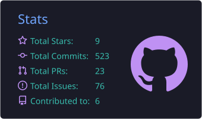
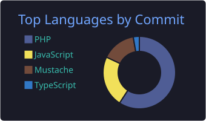
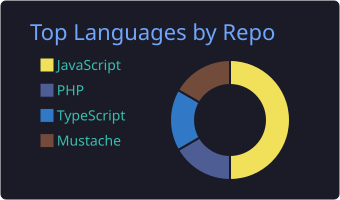
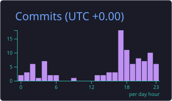

  

 

## About

I'm studying Computer Science at UNRC, in Río Cuarto, Córdoba.

---

## Stack

  

  

  

---

## GitHub stats

  
  
  
  

---

## Projects

| Project | What it is | Tech |
|---------|------------|------|
| [**schemakit**](https://github.com/alejobonavia003/schemakit) | Template for launching servers on Railway | `React` `Node.js` |
| [**Proyecto-integrador-Ing-2026**](https://github.com/alejobonavia003/Proyecto-integrador-Ing-2026) | University capstone project | `Java` `Spark` |
| [**ImperioSur**](https://github.com/alejobonavia003/ImperioSur) | WordPress plugin | `PHP` |

---

## Contributions

  <picture>
    <source media="(prefers-color-scheme: dark)" srcset="https://raw.githubusercontent.com/alejobonavia003/alejobonavia003/output/github-snake-dark.svg" />
    <source media="(prefers-color-scheme: light)" srcset="https://raw.githubusercontent.com/alejobonavia003/alejobonavia003/output/github-snake.svg" />
    
  </picture>

---

## Contact

<!-- Uncomment and fill in when you have the real details:

-->

